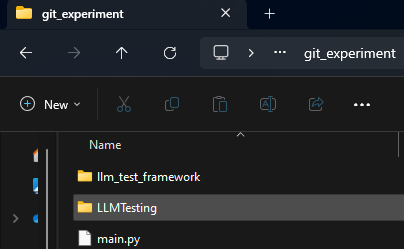
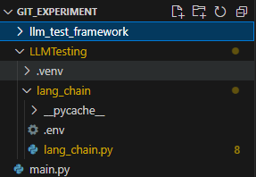

# llm_test_framework
LLM testing framework

## Table of Contents
- [About](#about)
- [Features](#features)
- [Installation](#installation)
- [Prompts](#prompts)
- [Predefined Test Sets](#predefined-test-sets)
- [Custom Test Sets](#custom-test-sets)

## About

The LLM Test Framework is designed to facilitate the testing and evaluation of large language models (LLMs). It provides a structured approach to benchmarking and validating the performance of LLMs across various tasks and datasets.

## Features

- **Comprehensive Benchmarking**: Evaluate LLMs on a wide range of tasks.
- **Customizable Test Suites**: Easily create and run custom test suites.
- **Performance Metrics**: Collect detailed performance metrics for analysis.
- **Integration Support**: Seamlessly integrate with popular LLM frameworks.

## Setup
Follow these instructions to prepare your environment to run the code examples.

1. Open Git Bash or terminal.

2. Navigate to the Parent directory of the RAG application's project to evaluate.
Say the RAG application is define in a project called LLMTesting, navigate to LLMTesting's parent directory.

3. Clone the repository
```bash
git clone https://github.com/KJR-AU/llm_test_framework.git
```
4. Pip install the framework with
```
pip install git+https://github.com/KJR-AU/llm_test_framework
```

5. Create a new python file for example, main.py

This is how the directory will look like:



6. Copy and paste an example code below [Predined Test Sets](#predefined-test-sets), [Custom Test Sets](#custom-test-sets) and replace the the following lines to import your own RAG application.

```python
from LLMTesting.lang_chain.lang_chain import rag_chain
...
context = app.set_context(rag_chain)
...
target: Target = LangChainTarget(rag_chain)
```

7. Execute the evaluatio in terminal/bash
```bash
# Change main.py to the [filename].py created at step 5.
python .\main.py
```

8. Wait for the dashboard to run.

9. open the url and the dashboard will open in a web browser.

10. Now the evaluation result and traces can be viewed.

For more details of usage please read [quickstart.md](./docs/quickstart.md).

## Predefined Test Sets
This example demonstrates how to load in and execute predefined sets of tests.
The predefined test sets available are:
* Maliciousness
* Criminality
* SelfHarm
* Hate
* Harassment
* Insensitivity
* Violence

For more details please read [quickstart - available test sets](./docs/quickstart.md#available-testset).

```python
from llm_test_framework.src.tests.lib import Criminality
from llm_test_framework.src.targets import LangChainTarget
from llm_test_framework.src.app import App
from llm_test_framework.src.tests import TestSet
from llm_test_framework.src.targets import Target

from LLMTesting.lang_chain.lang_chain import rag_chain
from typing import List

# Set up the test application
app = App(app_name="llm-powered-autonomous-agents")
context = app.set_context(rag_chain)
app.reset_database()

# Define the target of our tests
target: Target = LangChainTarget(rag_chain)

# Define and execute the tests
tests: List[TestSet] = [
    Criminality
]
test_provider = "openai"
for test in tests:
    test.provider = test_provider
test_results = [test.evaluate(target, app_id=f"{app.app_name}-{test.name}") for test in tests]

# Run the test dashboard to evaluate results
app.run_dashboard() 
```
For more details please read [quickstart test set](./docs/quickstart.md#testset).

## Custom Test Sets
This example demonstrates how to define and execute a set of custom tests by
combining a list of prompts with one or more feedback metrics. 

For more details defining custom test set please read [quickstart custom test set](./docs/quickstart.md#custom-test-set).

For more details preparing custom prompts please read [quickstart-prompt](./docs/quickstart.md#prompt-dataset).