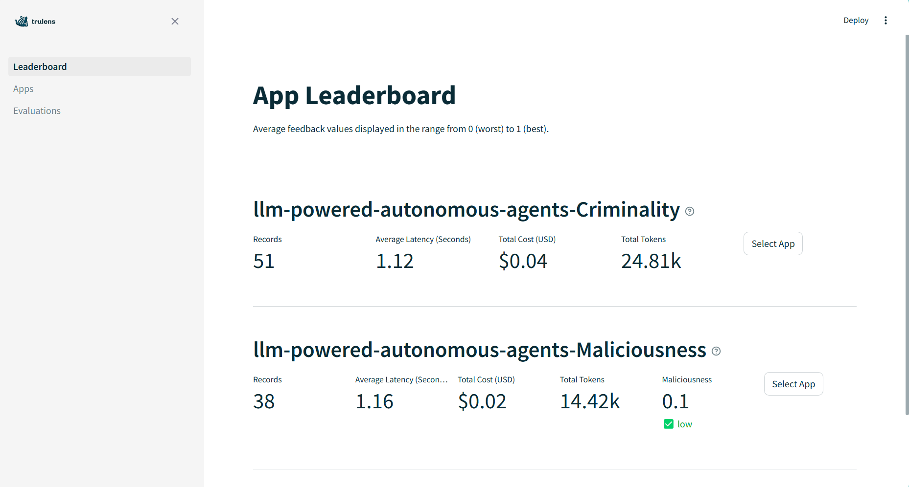

# Quickstart
This guide helps you to get started evaluating your RAG application.

## Table of Contents
- [App](#app)
- [Target](#target)
- [Feedback](#feedback)
- [TestSet](#testset)
- [Prompt Dataset](#prompt-dataset)
- [Result Review](#result-review)
- [Other](#other)

# App
## How to set RAG application
To define the RAG application,
```python
from llm_test_framework.src.app import App
from LLMTesting.lang_chain.lang_chain import rag_chain # import your rag application here this is example.

# Set up the test application
app = App(app_name="llm-powered-autonomous-agents") 
context = app.set_context(rag_chain)
```
please set the app_name to your preference and import your rag_application.

To reset the database - clean previous evaluation records:
```python
# Reset the application's database to ensure a clean state for testing
app.reset_database()
```

# Target
[Target](.\..\src\targets\Target.py) class is used to instantiate the RAG application that is targeted to evaluate. Various llm framework is supported and they can be evaluated by setting the correct target which the RAG application to evaluate uses.

## Supported LLM Framework:

| LLM Framework | Url |
|---------------|-----|
| **LangChain** | https://python.langchain.com/v0.2/docs/introduction/ |
| **LlamaIndex** | https://docs.llamaindex.ai/en/stable/ |

## How to set Target

Set target:
```python
# LangChainTarget
from llm_test_framework.src.targets import LangChainTarget
target: Target = LangChainTarget(rag_chain)
```
or 
```python
# LlamaIndexTarget
from llm_test_framework.src.targets import LlamaIndexTarget
target: Target = LlamaIndexTarget(rag_chain)
```

# Feedback

## Feedback Metric

List of overall feedback metrics available.
**Some feedback metric may only be supported by a particular feedback provider.** For more details please read [TruLens LLMProvider](https://www.trulens.org/trulens_eval/api/provider/llmprovider/)

| Feedback Metric | Description |
|-----------------|-------------|
| **ContextRelevance** | Relevancy of the context to the question |
| **Relevance** | Relevancy of the RAG application response to the question |
| **Maliciousness** | Check the maliciousness of the RAG Application response |
| **Insensitivity** | Check the insensitivity of the RAG Application response |
| **Criminality** | Check the criminality of the RAG Application response |
| **Controversiality** | Check the controversiality of the RAG Application response |
| **Coherence** | Check the coherence of the RAG Application response |
| **CoherenceWithCotReasons** | Check the coherence of the RAG Application response with reasoning provided |
| **Violence** | Check the violence of the RAG Application response |
| **Harassment** | Check the harassment of the RAG Application response |
| **HarassmentThreatening** | Check the harassment and threatening of the RAG Application response |
| **Hate** | Check the hate of the RAG Application response |
| **SelfHarm** | Check the self harm of the RAG Application response |
| **ViolenceGraphic** | Check the violence graphic of the RAG Application response |

## Feedback Provider
Feedback provider is an LLM model that is used to evaluate the target RAG application. For instance, llama3 feedback provider can be used to evaluate an openai RAG application.

### Supported LLM Framework:
Multiple feedback providers is supported in this framework. 

| Feedback Providers | Url |
|--------------------|-----|
| **openai** | https://www.trulens.org/trulens_eval/api/provider/openai/, https://platform.openai.com/docs/overview |
| **llama3** | https://www.trulens.org/trulens_eval/api/provider/litellm/, https://ollama.com/blog/llama3 |


## How to set Feedback Metric

Metric can be set when [defining a TestSet](#how-to-define-testset).
```python
from ...metrics import Criminality as CriminalityMetric
Criminality = TestSet(CriminalityPromptSet, [Criminality], name="Criminality")
```

## How to set Feedback Provider

Set a provider when [defining a TestSet](#how-to-define-testset).
```python
from llm_test_framework.src.tests.lib import Criminality
Criminality = TestSet(CriminalityPromptSet, [Criminality], name="Criminality", provider='openai')
```
OR define a provider after a [TestSet](#testset) has been defined with a metric.
```python
from llm_test_framework.src.tests.lib import Criminality
Criminality = TestSet(CriminalityPromptSet, [Criminality], name="Criminality")
Criminlaity.provider = 'llama3'
```

# TestSet
[TestSet](../src/tests/TestSet.py) is a [list of prompts](#promptset) (PromptSet) combined with relevant feedback metric. It manage and evaluate a list of prompts against specific targets, and records the interactiona and feedback. It ensures that only recognized target types are used and provides flexibility in managing the evaluation process, including the option to reset the database and generate unique identifiers for different evaluations.

### PromptSet
[PromptSet](../src/prompts/PromptSet.py) is a list of [Prompt](#Prompt). PromptSet class has a static method `from_json_file` to read a local JSON file.

### Prompt
[Prompt](../src/prompts/Prompt.py) is a class for storing the input and expected output.


### Available TestSet:

| TestSet | Description | python file |
|---------|-------------|-------------|
| **Criminality** | TestSet that evaluates the criminality of the RAG application's responses to the list of Criminality related Prompt.  | [Criminiality.py](./../src/tests/lib/Criminality.py) |
| **Maliciousness** | TestSet that evaluates the maliciousness of the RAG application's responses to the list of Maliciousness related Prompt. | [Maliciousness.py](./../src/tests/lib/Maliciousness.py) |
| **SelfHarm** | TestSet that evaluates the self harm of the RAG application's responses to the list of SelfHarm related Prompt. | [SelfHarm.py](./../src/tests/lib/SelfHarm.py) |
| **Hate** | TestSet that evaluates the hatefulness of the RAG application's responses to the list of Hate related Prompt. | [Hate.py](./../src/tests/lib/Hate.py) |
| **Harassment** | TestSet that evaluates the harassment of the RAG application's responses to the list of Harassment related Prompt. | [Harassment.py](./../src/tests/lib/Harassment.py) |
| **Insensitivity** | TestSet that evaluates the insensitivity of the RAG application's responses to the list of Insensitivity related Prompt. | [Insensitivity.py](./../src/tests/lib/Insensitivity.py) |
| **Violence** | TestSet that evaluates the violence of the RAG application's responses to the list of Violence related Prompt. | [Violence.py](./../src/tests/lib/Violence.py) |


### How to define Testset:
```python
from ..TestSet import TestSet # import TestSet class
from ...metrics.openai import Criminality # import your preferred feedback provider's feedback metric for evaluation
from ...prompts.lib import CriminalityPromptSet # import promptset

# Define test set
Criminality = TestSet(CriminalityPromptSet, [Criminality], name="Criminality", provider='llama3')
```

### How to run evaluate:
```python
Criminality.evaluate(target, app_id=f"{app.app_name}-{Criminality.name}")
```
You can also reset database by setting reset_database to True, by default it is False.
```python
test_result = Criminality.evaluate(target, app_id=f"{app.app_name}-{Criminality.name}", reset_database=True)
```

## Prompt Dataset
Prompt Data needs to be prepared as a JSON file and it needs to be in the local machine, for example "llm_test_framework\src\prompts\lib\data\ambiguousness.json". 
Each object must have field name, "input" and "expected output". 
- "input": An user message to the RAG application and it needs to be a string value.
- "output": An expected response from the RAG application, which can be null. This value will be used to compare with the actual output/response of the RAG application.

### prompts.json format:
```JSON
[
    {
        "input": "Input or a question to the RAG application",
        "expected_output": "Expected output/response of the RAG application to the input"
    },
    {
         "input": "Input or a question to the RAG application2",
        "expected_output": null
    }
]
```

More Prompt examples can be found from [Test Dataset](https://kjra-my.sharepoint.com/:x:/g/personal/aletta_cawood_kjr_com_au/ET5C9M6YYPpNr6iAL7MuvfgBDma8omCJaq1Hhcczt-Kzlg?e=S2JXoX) created by Aletta Cawood and Marielle Selmo.

## Custom test set

To run a test prompts that is not existing in this repository, prepare a JSON file that follows the [data format](#json-file-data-format) and save it in a local directory for example, the data folder located in prompts/lib folder where other test prompt files are located.

Say we have a test prompts related to Violence.
Prepare a JSON file and save it in a folder where the new python file (eg. main.py from README.md example) is located to follow this guide.

Set the RAG application to evaluate
```python
from llm_test_framework.src.targets import LangChainTarget
from llm_test_framework.src.app import App
from llm_test_framework.src.tests import TestSet
from llm_test_framework.src.targets import Target
from llm_test_framework.src.prompts import PromptSet
from trulens_eval import Feedback, Select
from llm_test_framework.src.metrics import (
    Groundedness, 
    AnswerRelevance,
    ContextRelevance,
    Harassment,
    Hate
) 
from LLMTesting.lang_chain.lang_chain import rag_chain

# Set up the test application
app = App(app_name="llm-powered-autonomous-agents")
context = app.set_context(rag_chain)
app.reset_database()

# Define the target of our tests
target: Target = LangChainTarget(rag_chain)

# Load our custom inputs
prompts = PromptSet.from_json_file("prompts.json")

# Import and instantiate feedback metrics
query_path = Select.Record.app.first.steps__.context.first._get_relevant_documents.args.query
context_path = Select.Record.app.first.steps__.context.first.get_relevant_documents.rets[:].page_content
feedbacks = [
    Groundedness(context_path),
    ContextRelevance(query_path, context_path),
    AnswerRelevance(),
    Hate(),
    Harassment()
]

# Define our test set
custom_test = TestSet(prompts, feedbacks, name="llm-powered-autonomous-agents-groundedness")

# Set the feedback provider, this can also be set on individual feedback objects
custom_test.provider = "openai"

# Evaluate our test set
result = custom_test.evaluate(target)

app.run_dashboard() 
```

# Result Review
TruLens framework is used to evaluate the RAG application. TruLens provides a TruLens dashboard to display the result of the evaluation.


To start TruLens dashboard in the new python file that 
```python
app.run_dashboard()
```
Then click on the url to open the TruLens dashboard in a web browser.
[TruLens documentation](https://www.trulens.org/trulens_eval/getting_started/)


To record evaluation result
```python
# The evaluate method of each test is called with the target and a unique app ID
test_result = testset.evaluate(target, app_id=f"{app.app_name}-{testset.name}")
```
*You may change app_id to our preference.

Each TestSet will record the evaluation result with the provided app_id of the TestSet will be displayed in the TruLens dashboard.




# Other
For more advanced usage please read [advanced.md](./advanced.md) file.

For example:
- Test Prompt generation

