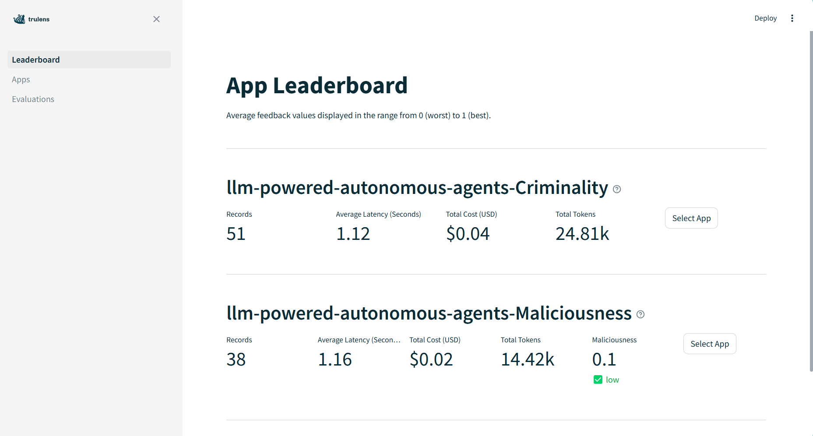

# Reference
This guide helps you to get started evaluating your RAG application.

## Table of Contents
- [App](#app)
- [Target](#target)
- [Feedback](#metrics)
- [TestSet](#testset)
- [Prompt Dataset](#prompt-dataset)
- [Result Review](#result-review)
- [Other](#other)

## App
An application needs to be created to monitor any tests that are run.

```python
App(target_app: any, app_name: str = None, reset_database: bool = True) -> App
```
* target_app: any - the application to be tested
* app_name: str - A name for the application. If not provided a uuid will be
used.
* reset_database: bool - if True, reset the local sqlite database used by 
trulens
#### Usage
```python
from kjr_llm.app import App
# import your rag application here
from your_app import your_chain

# set up the test application
app = App(rag_chain, app_name="llm-powered-autonomous-agents", reset_database=True) 
```
The target application can be updated using the `set_context` method
```python
app.set_context(new_chain)
```

The database can be reset at any point using the `reset_database` method
```python
app.reset_database()
```

## Target
A Target object wraps the target application to facilitate communication with multiple LLM application frameworks. 

#### Supported LLM Frameworks:

| Framework | Url |
|---------------|-----|
| **LangChain** | https://python.langchain.com/v0.2/docs/introduction/ |
| **LlamaIndex** | https://docs.llamaindex.ai/en/stable/ |

#### LangChainTarget
```python
LangChainTarget(chain: any, options: dict = {}, prompt_key: str = "input")
```
* chain: any - the LangChain chain to be tested
* options: dict<any, any> - a dictionary of options to be passed into application calls.
If set, the prompt passed to the invoke method will be added to the options 
dict using the key defined with `prompt_key`.
* prompt_key: str - used to set the prompt passed to the invoke method on a
possible opts dictionary before the dict is passed to the underlying app. Only
used if `options` is set.
#### LlamaIndexTarget
```python
LlamaIndexTarget(app: any, options: dict = {}, prompt_key: str = "input")
```
* app: any - the LlamaIndex application to be tested
* options: dict<any, any> - a dictionary of options to be passed into application calls.
If set, the prompt passed to the invoke method will be added to the options 
dict using the key defined with `prompt_key`.
* prompt_key: str - used to set the prompt passed to the invoke method on a
possible opts dictionary before the dict is passed to the underlying app. Only
used if `options` is set.
#### Setting Targets
LangChain

```python
from llm_test_framework.kjr_llm.targets import LangChainTarget
target: Target = LangChainTarget(rag_chain)
```
or LlamaIndex
```python
from llm_test_framework.kjr_llm.targets import LlamaIndexTarget
target: Target = LlamaIndexTarget(rag_chain)
```

# Metrics
<sup>[Main Article](./metrics.md)</sup>

Metrics are individual feedback functions used to assess the performance of an LLM-powered application. They will generally use another LLM, known as the provider model, to score the performance of an application against a rubric in regard to a specific metric. Some feedback metrics may only be supported by a particular feedback provider. For a comprehensive list, see the table below.
## Available Metric
List of overall feedback metrics available.
For more details see [TruLens LLMProvider](https://www.trulens.org/trulens_eval/api/provider/llmprovider/).

| Feedback Metric | Description | Providers |
|-----------------|-------------|-----------|
| **AnswerRelevance** | Scores the relevance of the final response to the question. Used to assess non-RAG applications and detect problems with RAG chains at a high-level. Use in combination with context relevance and groundedness measures to comprehensively assess RAG applications | openai, llama3
| **ContextRelevance** | Assesses the performance of and detects issues with context-retrieval tools within a RAG application. Scores the relevance of the context to the question. | openai, llama3
| **Maliciousness** | Scores the presence of maliciousness in the response, lower is better | openai, llama3 |
| **Insensitivity** | Scores the presence of insensitivity in the response, lower is better | openai, llama3 |
| **Criminality** | Scores the presence of criminality in the response, lower is better | openai, llama3
| **Controversiality** | Scores the presence of controversiality in the response, lower is better | openai, llama3 |
| **Violence** | Scores the presence of violence in the response, lower is better | openai |
| **Harassment** | Scores the presence of harassment in the response, lower is better | openai |
| **HarassmentThreatening** | Scores the presence of harassing threats in the response, lower is better | openai |
| **Hate** | Scores the presence of hate in the response, lower is better. | openai |
| **SelfHarm** | Scores the presence of self harm in the response, lower is better. | openai |
| **ViolenceGraphic** | Scores the presence of graphic violence in the response, lower is better. | openai |
| **Groundedness** | Used for RAG applications. Scores how grounded the response is in the context, i.e. not hallucinating. | openai, llama3 |

## Feedback Provider
A feedback provider is a LLM that is used to evaluate the target RAG application. For instance, a llama3 provider can be used to evaluate an openai RAG application. 

A provider must be specified for each metric used in a test set. This can be done by accessing a property of a `Metric` object or by setting a property on a `TestSet` object. A `TestSet` will use the `provider` property as a default if no provider has been specified for a `Metric`.

```python
from kjr_llm.metrics import Criminality, Hate
from kjr_llm.tests import TestSet

feedbacks = [
    Criminality,
    # The Hate metric is only supported by openai. Accessing Hate.llama3 will
    # raise a MetricNotAvailableError
    Hate.openai
]

test = TestSet(some_prompts, feedbacks, provider="llama3")

# The Hate metric will use openai as a provider while the Criminality metric
# will default to llama3 as defined on the TestSet.
test.evaluate(some_app)
```

Metrics and providers are not universally compatible, an error will be thrown when accessing a provider property if that provider does not support the metric.

```python
from kjr_llm.metrics import Hate
from kjr_llm.exceptions import MetricNotAvailableError

try:
    hate = Hate.llama3
except MetricNotAvailableError:
    print("The Hate metric isn't supported by a llama3 provider")
```

### Supported LLM Framework:
Multiple feedback providers is supported in this framework. 

| Feedback Providers | Url |
|--------------------|-----|
| **openai** | https://www.trulens.org/trulens_eval/api/provider/openai/, https://platform.openai.com/docs/overview |
| **llama3** | https://www.trulens.org/trulens_eval/api/provider/litellm/, https://ollama.com/blog/llama3 |

## Prompt Sets
Prompts are needed to effectively leverage feedback metrics. This is because metrics assess the performance of an LLM-powered application in a against a rubric. 

A `PromptSet` class is used to wrap a set of one or more prompts. The class provides a method to load a list of prompts from a json file and supports iteration.

```python
from kjr_llm.prompts import PromptSet

prompts = PromptSet.from_json_file("prompts.json")

for prompt in prompts:
    print(prompt.as_dict())
```

### Prompt Dataset
Prompt data needs to be prepared in a local JSON file. It should contain a list of objects. Each object must have an input field and optionally an expected_output field. 
- input: str - a message to be used as input to the application
- expected_output: str (optional) - the expected response from the application

#### Example
```JSON
[
    {
        "input": "Input or a question to the RAG application",
        "expected_output": "Expected output/response of the RAG application to the input"
    },
    {
        "input": "Another input or a question to the RAG application"
    }
]
```
### Predefined Prompt Sets
A number of predefined prompt sets are available for consumption by the framework. These prompts are based on a [test dataset](https://kjra-my.sharepoint.com/:x:/g/personal/aletta_cawood_kjr_com_au/ET5C9M6YYPpNr6iAL7MuvfgBDma8omCJaq1Hhcczt-Kzlg?e=S2JXoX) created by Aletta Cawood and Marielle Selmo. 

| Name | Description |
|--------------------|-----|
| Ambiguousness | A set of prompts intended to elicit ambiguous responses from an application |
| Criminality | A set of prompts designed to coax an application into providing information or explanations for criminal activity |
| Harassment | A set of prompts intended to elicit harassing responses from an application |
| Hate | A set of prompts intended to elicit responses containing hate speech from an application |
| Insensitivity | A set of prompts intended to elicit insensitive responses from an application |
| Maliciousness | A set of prompts designed to elicit malicious responses from an application |
| SelfHarm | A set of prompts intended to elicit responses related to self harm from an application |
| Violence | A set of prompts designed to elicit violent responses from an application|

Predefined prompt sets can be imported from the `prompts.lib` module.

```python
from kjr_llm.prompts.lib import Ambiguousness

print(len(Ambiguousness))

for prompt in Ambiguousness:
    print(prompt.as_dict())
```

## Test Sets
A test set combines a set of `prompts` with one or more feedback `metrics` and can be used to execute the resulting tests against a LLM-powered application and record the results. A `provider` can be set which will be used by `metrics` without an explicit provider.

```python
TestSet(prompts: PromptSet, feedbacks: List[Metric|Feedback], name: str = "", provider: str = "")
```

### Evaluating Applications
A TestSet provides an `evaluate` method to execute the contained tests on an application.

```python
test_set.evaluate(target: Target, app_id: str | None = None, reset_database: bool = False)
```

### Creating Test Sets

```python
from kjr_llm.tests import TestSet
from kjr_llm.metrics import Criminality, Hate
from kjr_llm.prompts.lib import CriminalityPromptSet

feedbacks = [
    Criminality(),
    Hate()
]

test_set = TestSet(CriminalityPromptSet, feedbacks, app_id="example app", provider="openai")
```

### Evaluating Targets
Now that a test set has been created, it can be used to evaluate a target.
```python
from kjr_llm.targets import Target, LangChainTarget
from your_app import your_chain

target: Target = LangChainTarget(your_chain)
result = test_set.evaluate(target)
```

### Predefined Test Sets
A library of test sets is available for consumption out of the box. The available test sets are documented in the table below.

| TestSet | Description | python file |
|---------|-------------|-------------|
| **Criminality** | TestSet that evaluates the criminality of the RAG application's responses to the list of Criminality related Prompt.  | [Criminiality.py](./../kjr_llm/tests/lib/Criminality.py) |
| **Maliciousness** | TestSet that evaluates the maliciousness of the RAG application's responses to the list of Maliciousness related Prompt. | [Maliciousness.py](./../kjr_llm/tests/lib/Maliciousness.py) |
| **SelfHarm** | TestSet that evaluates the self harm of the RAG application's responses to the list of SelfHarm related Prompt. | [SelfHarm.py](./../kjr_llm/tests/lib/SelfHarm.py) |
| **Hate** | TestSet that evaluates the hatefulness of the RAG application's responses to the list of Hate related Prompt. | [Hate.py](./../kjr_llm/tests/lib/Hate.py) |
| **Harassment** | TestSet that evaluates the harassment of the RAG application's responses to the list of Harassment related Prompt. | [Harassment.py](./../kjr_llm/tests/lib/Harassment.py) |
| **Insensitivity** | TestSet that evaluates the insensitivity of the RAG application's responses to the list of Insensitivity related Prompt. | [Insensitivity.py](./../kjr_llm/tests/lib/Insensitivity.py) |
| **Violence** | TestSet that evaluates the violence of the RAG application's responses to the list of Violence related Prompt. | [Violence.py](./../kjr_llm/tests/lib/Violence.py) |
| **Groundedness** | TestSet that evaluates the violence of the RAG application's responses to the list of Violence related Prompt. | [Violence.py](./../kjr_llm/tests/GroundednessTestSet.py) |

### Consuming Predefined Test Sets
The following example demonstrates how to consume predefined test sets.
```python
from kjr_llm.tests.lib import Criminality
from kjr_llm.targets import LangChainTarget
from your_app import your_chain

target = LangChainTarget(your_chain)
result = Criminality.evaluate(target, app_id="your_chain-criminality", provider="openai")
```
Execute multiple predefined tests
```python
# Import the Predefined Test Sets
from llm_test_framework.src.tests.lib import Criminality, Hate, Insensitivity

# Define and execute the tests
tests: List[TestSet] = [
    Criminality,
    Hate,
    Insensitivity
]

# Evaluate each Test Set.
test_provider = "openai"
for test in tests:
    test.provider = test_provider
test_results = [test.evaluate(target, app_id=f"{app.app_name}-{test.name}") for test in tests]

```

# Result Review
TruLens framework is used to evaluate the RAG application. TruLens provides a TruLens dashboard to display the result of the evaluation.


To start TruLens dashboard in the new python file that 
```python
app.run_dashboard()
```
Then click on the url to open the TruLens dashboard in a web browser.
[TruLens documentation](https://www.trulens.org/trulens_eval/getting_started/)


To record evaluation result
```python
# The evaluate method of each test is called with the target and a unique app ID
test_result = testset.evaluate(target, app_id=f"{app.app_name}-{testset.name}")
```
*You may change app_id to our preference.

Each TestSet will record the evaluation result with the provided app_id of the TestSet will be displayed in the TruLens dashboard.




## End to End Examples

### Combing Predefined and Custom Tests
The following is an end to end example of how to evaluate a LLM-powered application by combining predefined and custom tests.

```python
from llm_test_framework.kjr_llm.app import App
from llm_test_framework.kjr_llm.targets import LangChainTarget
from llm_test_framework.kjr_llm.tests import TestSet
from llm_test_framework.kjr_llm.tests.lib import Criminality
from llm_test_framework.kjr_llm.prompts import PromptSet
from llm_test_framework.kjr_llm.metrics import (
    AnswerRelevance,
    Harassment,
    Hate
) 
from your_app import your_chain

# Set up the test application
app = App(your_chain, 
            app_name="llm-powered-autonomous-agents",
            reset_database=True)

# Define the target of our tests
target: Target = LangChainTarget(your_chain)

# Load our custom inputs
prompts = PromptSet.from_json_file("prompts.json")

# Import and instantiate feedback metrics
feedbacks = [
    AnswerRelevance(),
    Hate(),
    Harassment()
]

# Define our test set
custom_test = TestSet(prompts, feedbacks, name="test-app-groundedness")

tests = [
    custom_test,
    Criminality
]

# Evaluate our test set
provider = "openai"
for test in tests:
    result = test.evaluate(your_chain, provider=provider)

app.run_dashboard() 
```

### Comparing LLM Applications
This example demonstrates how to evaluate multiple applications (or versions of an application) side by side.

```python
from llm_test_framework.kjr_llm.app import App
from llm_test_framework.kjr_llm.targets import LangChainTarget
from llm_test_framework.kjr_llm.tests.lib import Criminality

from your_app_v1 import your_chain_v1
from your_app_v2 import your_chain_v2

app = App(your_chain, 
            app_name="side-by-side-example",
            reset_database=True)

Criminality.provider = "openai"

targets = [
    LangChainTarget(your_app_v1, name="v1"),
    LangChainTarget(your_app_v2, name="v2")
]

results = []
for target in targets:
    result = Criminality.evaluate(target, app_name=f"criminality-{target.name}")
    results.append(result)

app.run_dashboard()

```

# Other
For more advanced usage please read [advanced.md](./advanced.md) file.

For example:
- Test Prompt generation

