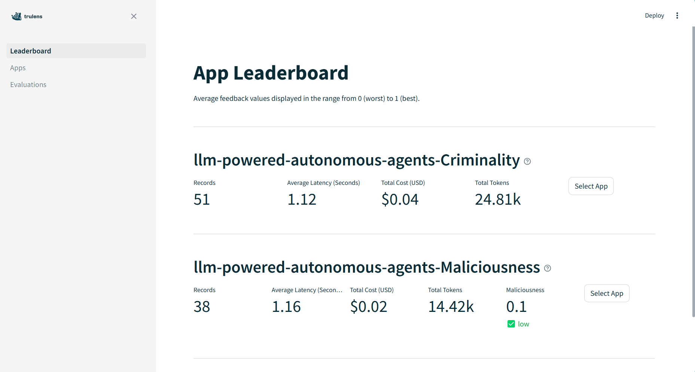

# Quickstart
This guide helps you to get started evaluating your RAG application.

## Table of Contents
- [Target](#Target)
- [Features](#features)
- [Installation](#installation)
- [Prompts](#prompts)
- [Usage](#usage)
- [Contributing](#Contributing)

# Target
[Target](.\..\targets\Target.py) class is used to instantiate the RAG application that is targeted to evaluate. Multiple llm framework is supported and they can be evaluated by setting the correct target which the RAG application uses.

## Supported LLM Framework:

| LLM Framework | Url |
|---------------|-----|
| **LangChain** | https://python.langchain.com/v0.2/docs/introduction/ |
| **LlamaIndex** | https://docs.llamaindex.ai/en/stable/ |

## How to set Target

Import the supported target:
```python
from llm_test_framework.src.targets import LangChainTarget, LlamaIndexTarget
```
Set target:
```python
target: Target = LangChainTarget(rag_chain)
```
or 
```python
target: Target = LlamaIndexTarget(rag_chain)
```

# Feedback Metrics

Feedbacks can be imported from the metrics module within the framework.
```python
from ...metrics.llama3 import Maliciousness
```

List of overall feedback metrics available.
**Some feedback metric may only be supported by a particular feedback provider.** For more details please read [TruLens LLMProvider](https://www.trulens.org/trulens_eval/api/provider/llmprovider/)

| Feedback Metric | Description |
|-----------------|-------------|
| **ContextRelevance** | Relevancy of the context to the question |
| **Relevance** | Relevancy of the RAG application response to the question |
| **Maliciousness** | Check the maliciousness of the RAG Application response |
| **Insensitivity** | Check the insensitivity of the RAG Application response |
| **Criminality** | Check the criminality of the RAG Application response |
| **Controversiality** | Check the controversiality of the RAG Application response |
| **Coherence** | Check the coherence of the RAG Application response |
| **CoherenceWithCotReasons** | Check the coherence of the RAG Application response with reasoning provided |
| **Violence** | Check the violence of the RAG Application response |
| **Harassment** | Check the harassment of the RAG Application response |
| **HarassmentThreatening** | Check the harassment and threatening of the RAG Application response |
| **Hate** | Check the hate of the RAG Application response |
| **SelfHarm** | Check the self harm of the RAG Application response |
| **ViolenceGraphic** | Check the violence graphic of the RAG Application response |

# Feedback Provider
Feedback provider is an LLM model that is used to evaluate the target RAG application. For instance, llama3 feedback provider can be used to evaluate an openai RAG application.

## Supported LLM Framework:
Multiple feedback providers is supported in this framework. 

| Feedback Providers | Url | python file |
|--------------------|-----|-------------|
| **openai** | https://www.trulens.org/trulens_eval/api/provider/openai/, https://platform.openai.com/docs/overview | [openai.py](./../metrics/openai/metrics.py) |
| **llama3** | https://www.trulens.org/trulens_eval/api/provider/litellm/, https://ollama.com/blog/llama3 | [llama3.py](./../metrics/llama3/metrics.py) |

## How to set Feedback Provider
By default, feedback provider is set to **llama3**, 
```python
from ...metrics.llama3 import Criminality
```
to change to another feedback provider:

Import metric from the preferred feedback provider
```python
from ...metrics.openai import Criminality
```
And include the imported module when [defining a TestSet](#how-to-define-testset).

# TestSet
[TestSet](../tests/TestSet.py) is a list of prompts combined with relevant feedback metrics. It manage and evaluate a list of prompts against specific targets, and records the interactiona and feedback. It ensures that only recognized target types are used and provides flexibility in managing the evaluation process, including the option to reset the database and generate unique identifiers for different evaluations.

### How to define Testset:
Define TestSet
```python
# import 
from ..TestSet import TestSet # import TestSet class
from ...metrics.openai import Criminality # import the feedback provider's function
from ...prompts.lib import CriminalityPromptSet # import promptset

Criminality = TestSet(CriminalityPromptSet, [Criminality], name="Criminality")
```

### How to run evaluate:
```python
test.evaluate(target, app_id=f"{app.app_name}-{test.name}")
```


# PromptSet
[PromptSet](../prompts/PromptSet.py) is a list of Prompt. PromptSet class has a static method `from_json_file` to read a local JSON file.

## Dataset
Prompt Data needs to be prepared as a JSON file located in the local machine. Each object must have field name, "input" and "expected output". 
- "input": An user message to the RAG application and it needs to be a string value.
- "output": An expected response from the RAG application, which can be null. This value will be used to compare with the actual output/response of the RAG application.

Json file data format:
```JSON
[
    {
        "input": "Input or a question to the RAG application",
        "expected_output": "Expected output/response of the RAG application to the input"
    },
    {
         "input": "Input or a question to the RAG application2",
        "expected_output": null
    }
]
```

# Prompt
[Prompt](../prompts/Prompt.py) is a class for storing the input and expected output.

Prompt examples can be found from [Test Dataset](https://kjra-my.sharepoint.com/:x:/g/personal/aletta_cawood_kjr_com_au/ET5C9M6YYPpNr6iAL7MuvfgBitfUAVXzrAhBHhUvPEHCvA?e=6ytZo9) created by Aletta Cawood and Marielle Selmo.

## Custom test

To run a test prompts that is not existing in this repository, prepare a JSON file custom test prompts and save it in the data folder located in prompts/lib folder. 


The function [`evaluate`](./../tests/evaluate.py), uses `TruLens_eval` to evaluate the RAG application and run the TruLens dashboard to display the result of evaluation.

 document how custom test sets can be defined, basically defining a list of prompts and some related feedback functions. The TestSet class required a PromptSet and a list of feedbacks to create. There's a PromptSet class which wraps a list of prompts and a static method on this class to create a PromptSet from a local JSON file.


# Result Review
TruLens framework is used to evaluate the RAG application. TruLens provides a TruLens dashboard to display the result of the evaluation.
[TruLens documentation](https://www.trulens.org/trulens_eval/getting_started/)


To start TruLens evaluation use the below code and change the app_name to your preference.
```python
app = App(app_name="llm-powered-autonomous-agents")
```

To start TruLens dashboard in the new python file that 
```python
app.run_dashboard()
```

Define TestSet and change the name
```python
test = TestSet(CriminalityPromptSet, [Criminality], name="Criminality")
```

To reset any data in the TruLens database, this will clean any data in the TruLens dashboard of the previous evaluation.
```python
app.reset_database()
```
OR can reset by setting reset_database parameter as True in TestSet's evaluate static method.
```python
test_result = test.evaluate(target, app_id=f"{app.app_name}-{test.name}", reset_database=True)
```

To record evaluation result
```python
# The evaluate method of each test is called with the target and a unique app ID
test_result = test.evaluate(target, app_id=f"{app.app_name}-{test.name}")
```
The code above will not reset the trulens database, because reset_database is set to False by default.

*You may change app_id to our preference.

And the app_id will be displayed in the TruLens dashboard.




test dashboard
explain how each test set will result in its own application within the dashboard. we also might want to explain how and when the local test database is reset.

# Other
For more advanced usage please read [advanced.md](./advanced.md) file.

For example:
### Test Prompt generation


# Test Case generation
This is a placeholder for test prompt generation. for example, given a prompt example, create 100 more variation.